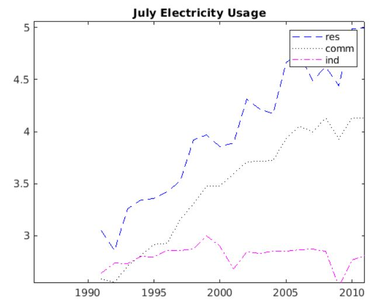
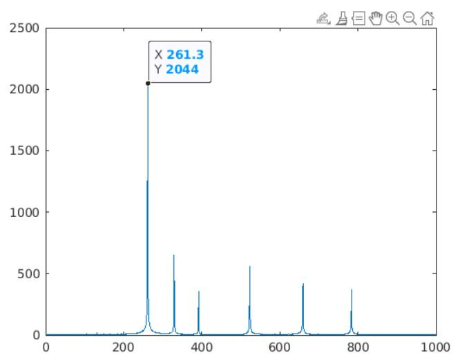
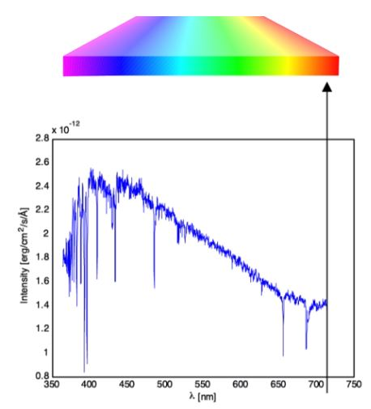
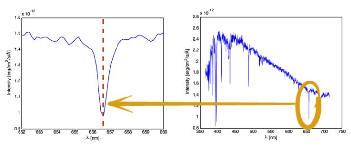
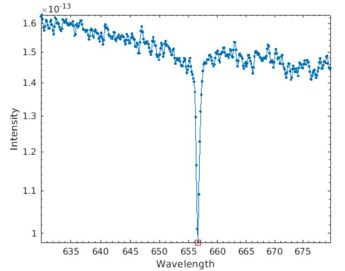
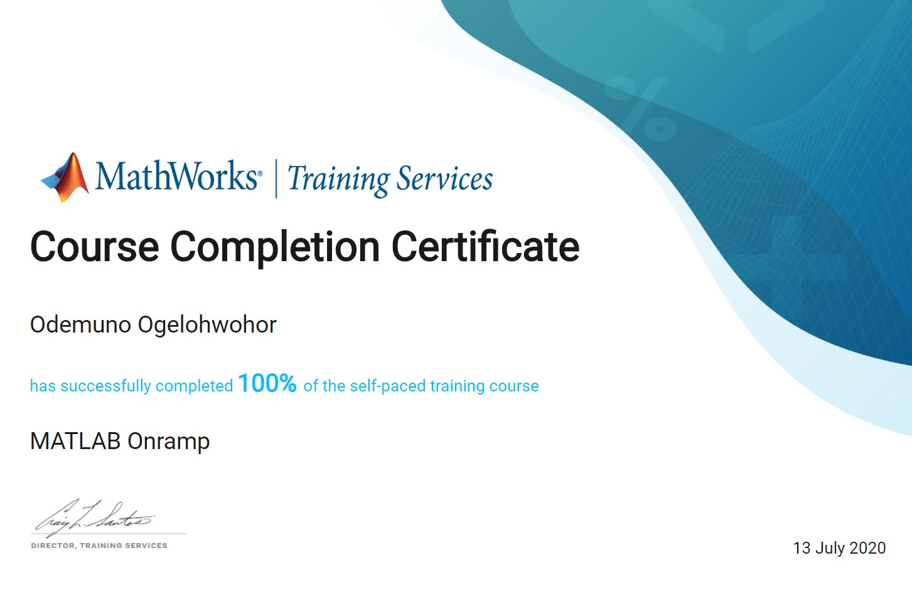

# MATLAB Onramp Projects

[MATLAB Onramp](https://matlabacademy.mathworks.com/) is a 1-2hr interactive introduction to MATLAB programming.

I am currently on week 2 of the [Machine Learning course](https://www.coursera.org/learn/machine-learning/home/welcome) by Stanford university on coursera. This section is titled "More Octave/MATLAB resources" and MATLAB OnRamp was recommended for a quick refresh.

I have previously used MATLAB for a linear algebra course at UCSD ([MATH 18 MATLAB](https://www.math.ucsd.edu/~math18/)), so I decided to just refresh my memory by completing this learning module.

Project topics:
1. Electricity Usage
2. Audio Frequency
3. Stellar Motion

## Project 1 - Electricity usage
### Description
Plot the electricity usage data for the residential, commercial, and industrial sectors and determine which sector uses the most electricity.

### Code

Load the MAT-file into MATLAB and use **usage** display the matrix
```
load electricity
usage
```

The first column is the data for electricity usage in residential areas. Store that info in a variable called *res*. The second column is commercial, while the third is industrial; store those volumns as vectors in the variables *comm* and *ind* respectively.
```
res = usage(:,1)
comm = usage(:,2)
ind = usage(:,3)
```

The data  was colected annually from 1991 to 2013. Create a vector named *yrs* that represents the years.
```
yrs = (1991:2013)'
```

Create a plot with all three columns, using these descriptions:
- *yrs* : the x-data
- *res*: blue(b) dashed line(--)
- *comm*: black(k) dotted line(:)
- *ind*: magenta(m) dash-dot line(-.)
- title: July Electricity Usage
- legend: res, comm, ind
```
plot(yrs,res,"b--")
hold on
plot(yrs,comm,"k:")
plot(yrs,ind,"m-.")
hold off
title("July Electricity Usage")
legend("res","comm","ind")
```


From the plot, the residential sector uses the most electricity over time.

## Project 2 - Audio Frequency
### Personal Background
Signals (especially audio) are core to Electrical Engineering. This takes several forms in some ECE courses I have taken:
- Digital signal processing (DSP)
- [Transistors](https://www.elprocus.com/difference-between-bjt-and-mosfet/) using BJTs, MOSFETs, and diodes 
- [Audio pass filters](https://theproaudiofiles.com/audio-pass-filters/#:~:text=An%20audio%20pass%20filter%20attenuates%20an%20entire%20range%20of%20frequencies.&text=A%20high%2Dpass%20filter%20(HPF,to%20pass%20through%20the%20filter.)): high, low, bandwidth 
- Frequency response and LTI systems
- Laplace transform
- Fourier series and Fourier transform
- Impulse and convolution

Audio signals comprise of different frequencies. Often times, we have to tune it to get the frequency we need.

### Description
> Audio signals are usually comprised of many different frequencies. For example, in music, the note 'middle C' has a fundamental frequency of 261.6 Hz, and most music consists of several notes (or frequencies) being played at the same time. In this project, you will analyze the frequency content of an organ playing the C chord.

### Code
#### Time vector *t* for signal *y*
Load the *Cchord.mat* file, which contins two variables:
- *y*: signal from recording
- *fs*: sampling frequency
```
load Cchord
```

Create variable *n* that contains the number of elements in y. Then use *n* to create evenly-spaced vector *t* from 0 to n-1, spaced by 1.
```
n = numel(y)
t = 0:n-1
```
Use the sampling frequency *fs* to convert the vector to time in seconds
```
t = t/fs
plot(t,y)
```


> In the plot, notice that y is periodic, but it's not a simple sine wave. It's made up of multiple sine waves with different frequencies.

> A Fourier transform will return information about the frequency content of the signal. The location of the dominant frequencies will show what notes are contained in the chord.

#### Frequency vector *f* for FFT vector *yfft*
Create variable *yfft* that contains the absolute value of the discrete Fourier transform of *y* and evenly-space vector *f* from 0 to n-1, spaced by 1.

```
yfft = abs(fft(y))
f = 0:n-1
```
Convert vector *f* to frequencies and plot the graph
```
f = f*(fs/n)
plot(f, yfft)
xlim([0 1000])
```


> The first three spikes are notes of the middle C chord. The 6 spikes correspond to the fundamental frequencies of a middle C chord. E.g the C4 note has a frequency of 261.6 Hz

## Project 3 - Stellar Motion

### Context
Use a diffraction grating to split a beam of light into individual wavelengths. Measuring the intensity of light observed at each wavelength gives the stars "characteristic spectrums."


Star spectrum blue toward
red away long

### Description
In this project, you will find the observed wavelength of the hydrogen-alpha line of the HD94028 star.



### Code
The spectra data is at evenly-spaced wavelengths.

```
load starData
nObs = size(spectra,1)
lambdaStart = 630.02
lambdaDelta = 0.14
```

Find the wavelength using delta as the steps
```
lambdaEnd = lambdaStart + (nObs - 1)*lambdaDelta
lambda = (lambdaStart:lambdaDelta:lambdaEnd)'
```
Each column of spectra is the spectrum of a different star. The sixth column is the spectrum of star HD 94028.
```
s = spectra(:, 6)
loglog(lambda, s,".-")
xlabel("Wavelength")
ylabel("Intensity")
```

#### Find the hydrogen-alpha line
>Create two variables, *sHa* and *idx* that contain the minimum value of *s* and the index where the minimum value occurred. Use *idx* to index into lambda to find the wavelength of the Hydrogen-alpha line. Store the result as *lambdaHa*. The line (*lambdaHa*,*sHa*) is the location of the Hydrogen-alpha line.

```
[sHa, idx] = min(s)
lambdaHa = lambda(idx)
hold on
loglog(lambdaHa, sHa, "rs", "MarkerSize",8)
```



From the plot, the wavelength of the hydrogen-alpha line is approximately at 656.1nm.

## Project Completion
