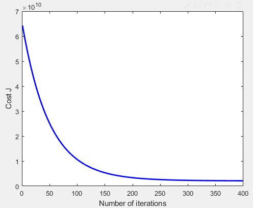
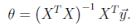

# Programming Assignment #1 - Linear Regression ML (optional part)
I decided to complete this section for extra practice, and also so that I know how to work with multiple variables.

## Linear Regression with Multiple Variables
> In this part, you will implement linear regression with multiple variables to predict the prices of houses. Suppose you are selling your house and you want to know what a good market price would be. One way to do this is to first collect information on recent houses sold and make a model of housing prices.

The data is gotten from the `ex1data2.txt` file.
### 1. Feature Normalization
Relevant scripts:
- `ex1_multi.m`
- `featureNormalize.m`

Feature normalization is a form of feature scaling when the features differ by various orders of magnitudes.

Task:
- Subtract the mean value of each feature from the dataset: use the `mean` function.
- After subtracting the mean, additionally scale (divide) the feature values
by their respective "standard deviations": use the `std` function.

Normalize the features by calling this function:
```
[X mu sigma] = featureNormalize(X);
```

Edit the `featureNormalize.m` file:
```
mu = mean(X);
sigma = std(X);

for i=1:size(X,2)
    X_norm(:,i) = (X_norm(:,i) - mu(i)) / sigma(i);
end
```

### 2. Gradient Descent
Relevant scripts:
- `computeCostMulti.m`
- `gradientDescentMulti.m`

```
% Init Theta and Run Gradient Descent 
theta = zeros(3, 1);
[theta, J_history] = gradientDescentMulti(X, y, theta, alpha, num_iters);

% Plot the convergence graph
figure;
plot(1:numel(J_history), J_history, '-b', 'LineWidth', 2);
xlabel('Number of iterations');
ylabel('Cost J');

% Display gradient descent's result
fprintf('Theta computed from gradient descent: \n');
fprintf(' %f \n', theta);
fprintf('\n');
```




Calculations:
Predict the price of a 1650 sqft(x1), 3 bedrom (x2) house using gradient descent
```
norm_price = ([1650 3]- mu) ./ sigma;
norm_price = [1 norm_price];
price = norm_price* theta;
```

Result:
```
Predicted price of a 1650 sq-ft, 3 br house (using gradient descent):
 $289314.620338
 ```

### 3. Normal Equations
Relevant scripts:
- `ex1_multi.m`
- `normalEqn.m`

The closed-form solution to linear resgression is: 

Characteristics:
- no feature scaling
- exact solution in one calculation
- no "loop until convergence" (compared to gradient descent)

In the `normalEqn.m` filr:
I added this code to do the computation:
```
theta = pinv(X'*X)*X'*y;
```

Calculations:
Predict the price of a 1650 sqft(x1), 3 bedrom (x2) house using normal equation
```
price = [1,1650, 3]*theta;
```

Result:
```
Predicted price of a 1650 sq-ft, 3 br house (using normal equations):
 $293081.464335
 ```
