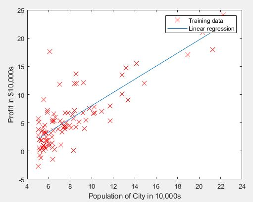
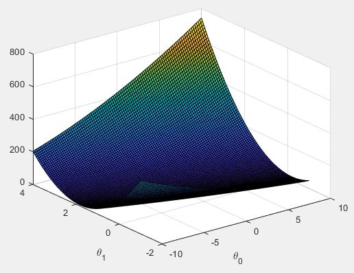
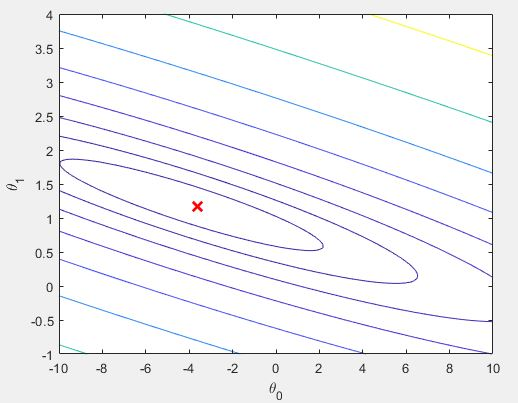

# Programming Assignment #1 - Linear Regression ML

This is my week 2 assignment solution for the [Machine Learning course](https://www.coursera.org/learn/machine-learning/home/welcome) by Stanford university on coursera. 

Software:
- MATLAB

This assignment covers topics on:
- Linear regression with one variable
- Plotting data
- Cost Function
- Gradient Descent
- Contour plots and suface plots
- Optional exercise: linear regression with multiple variables

### Provided Files
- ex1.m - Octave/MATLAB script that steps you through the exercise
- ex1 multi.m - Octave/MATLAB script for the later parts of the exercise
- ex1data1.txt - Dataset for linear regression with one variable
- ex1data2.txt - Dataset for linear regression with multiple variables
- submit.m - Submission script that sends your solutions to our servers
- warmUpExercise.m - Simple example function in Octave/MATLAB
- plotData.m - Function to display the dataset
- computeCost.m - Function to compute the cost of linear regression
- gradientDescent.m - Function to run gradient descent
- [O] computeCostMulti.m - Cost function for multiple variables
- [O] gradientDescentMulti.m - Gradient descent for multiple variables
- [O] featureNormalize.m - Function to normalize features
- [O] normalEqn.m - Function to compute the normal equations

*[O] indicates optional exercises

## 1: Basic Function

Complete warmUpExercise.m
- Make a 5X5 identity matrix
```
A = eye(5);
```
Output:
```
5x5 Identity Matrix: 

ans =

     1     0     0     0     0
     0     1     0     0     0
     0     0     1     0     0
     0     0     0     1     0
     0     0     0     0     1
```

## 2: Plotting
Suppose you are the CEO of restaurant franchise and are considering different cities for opning a new branch.

You'd like to use the given data to help you select which city to expand to next.

The dataset is gotten from the `ex1data1.txt` file.

To visualize, these are the first 6 dataset points:
```
6.1101,17.592
5.5277,9.1302
8.5186,13.662
7.0032,11.854
5.8598,6.8233
8.3829,11.886
```

```
plot(x, y, 'rx', 'MarkerSize', 10);   % Plot the data
xlabel('Population of City in 10,000s');  % The x-axis label
ylabel('Profit in $10,000s');    % The y-axis label
```


## 3: Cost and Gradient descent
The objective of linear regression is to minimize the cost function:


In batch gradient descent, each iteration updates using this equation:


This data is already setup for linear regression
```
X = [ones(m, 1), data(:,1)]; % Add a column of ones to x
theta = zeros(2, 1); % initialize fitting parameters
iterations = 1500;
alpha = 0.01;
```
I edited the cost function code
```
function J = computeCost(X, y, theta)
%COMPUTECOST Compute cost for linear regression
%   J = COMPUTECOST(X, y, theta) computes the cost of using theta as the
%   parameter for linear regression to fit the data points in X and y

% Initialize some useful values
m = length(y); % number of training examples

% You need to return the following variables correctly 
J = 0;

% ====================== YOUR CODE HERE ======================
% Instructions: Compute the cost of a particular choice of theta
%               You should set J to the cost.
predictions = X*theta;
sqrErrors = (predictions-y).^2;
J = 1/(2*m) * sum(sqrErrors);


% =========================================================================

end
```

Testing the cost function J(θ) by completing the code in the `computeCost.m` file.
```
J = computeCost(X, y, theta);
J = computeCost(X, y, [-1 ; 2]);
```

Results
```
Testing the cost function ...
With theta = [0 ; 0]
Cost computed = 32.072734
Expected cost value (approx) 32.07

With theta = [-1 ; 2]
Cost computed = 54.242455
Expected cost value (approx) 54.24
```
Running Gradient Descent by implementing the `gradientDescent.m` file which calls `computeCost` on every iteration. The final parameters are used to plot the linear fit (the blue line).



Using this fit, we can predict profit values for population sizes of 35,000 and 70,000
```
For population = 35,000, we predict a profit of 4519.767868
For population = 70,000, we predict a profit of 45342.450129
```

## 4: Visualizing J(θ_0, θ_1)
Using the `ex1.m` file -- the information needed to create the plots were given.

- plot the cost over a 2D grid of θ_0 and θ_1 values
- uses the `computeCost` function to calculate J(θ) over a grid of values
```
% Grid over which we will calculate J
theta0_vals = linspace(-10, 10, 100);
theta1_vals = linspace(-1, 4, 100);

% initialize J_vals to a matrix of 0's
J_vals = zeros(length(theta0_vals), length(theta1_vals));

% Fill out J_vals
for i = 1:length(theta0_vals)
    for j = 1:length(theta1_vals)
	  t = [theta0_vals(i); theta1_vals(j)];
	  J_vals(i,j) = computeCost(X, y, t);
    end
end
```
The values are used to produce a surface and contour plot:
#### Surface Plot
```
figure;
surf(theta0_vals, theta1_vals, J_vals)
xlabel('\theta_0'); ylabel('\theta_1');
```


#### Contour Plot
```
figure;
% Plot J_vals as 15 contours spaced logarithmically between 0.01 and 100
contour(theta0_vals, theta1_vals, J_vals, logspace(-2, 3, 20))
xlabel('\theta_0'); ylabel('\theta_1');
hold on;
plot(theta(1), theta(2), 'rx', 'MarkerSize', 10, 'LineWidth', 2);
```


> The purpose of these graphs is to show you that how J(θ) varies with
changes in θ0 and θ1. The cost function J(θ) is bowl-shaped and has a global
mininum. (This is easier to see in the contour plot than in the 3D surface
plot). This minimum is the optimal point for θ0 and θ1, and each step of
gradient descent moves closer to this point.