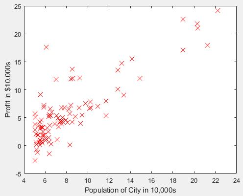
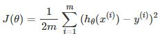
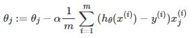

# Programming Assignment #1 - Linear Regression ML

This is my week 2 assignment solution for the [Machine Learning course](https://www.coursera.org/learn/machine-learning/home/welcome) by Stanford university on coursera. 

Software:
- MATLAB

This assignment covers topics on:
- Linear regression with one variable
- Plotting data
- Cost Function
- Gradient Descent
- Contour plots and suface plots
- Optional exercise: linear regression with multiple variables

### Provided Files
- ex1.m - Octave/MATLAB script that steps you through the exercise
- ex1 multi.m - Octave/MATLAB script for the later parts of the exercise
- ex1data1.txt - Dataset for linear regression with one variable
- ex1data2.txt - Dataset for linear regression with multiple variables
- submit.m - Submission script that sends your solutions to our servers
- warmUpExercise.m - Simple example function in Octave/MATLAB
- plotData.m - Function to display the dataset
- computeCost.m - Function to compute the cost of linear regression
- gradientDescent.m - Function to run gradient descent
- [O] computeCostMulti.m - Cost function for multiple variables
- [O] gradientDescentMulti.m - Gradient descent for multiple variables
- [O] featureNormalize.m - Function to normalize features
- [O] normalEqn.m - Function to compute the normal equations

*[O] indicates optional exercises

## Basic Function

Complete warmUpExercie.m
- Make a 5X5 identity matrix
```
A = eye(5);
```
Output:
```
5x5 Identity Matrix: 

ans =

     1     0     0     0     0
     0     1     0     0     0
     0     0     1     0     0
     0     0     0     1     0
     0     0     0     0     1
```

## Linear Regression with One Variable
Suppose you are the CEO of restaurant franchise and are considering different cities for opning a new branch.

You'd like to use the given data to help you select which city to expand to next.


### Plotting the Data
```
plot(x, y, 'rx', 'MarkerSize', 10);   % Plot the data
xlabel('Population of City in 10,000s');  % The x-axis label
ylabel('Profit in $10,000s');    % The y-axis label
```


### Gradient Descent
The objective of linear regression is to minimize the cost function:


In batch gradient descent, each iteration updates using this equation:


This data is already setup for linear regression:
```
X = [ones(m, 1), data(:,1)]; % Add a column of ones to x
theta = zeros(2, 1); % initialize fitting parameters
iterations = 1500;
alpha = 0.01;
```
I edited the cost function code:
```
function J = computeCost(X, y, theta)
%COMPUTECOST Compute cost for linear regression
%   J = COMPUTECOST(X, y, theta) computes the cost of using theta as the
%   parameter for linear regression to fit the data points in X and y

% Initialize some useful values
m = length(y); % number of training examples

% You need to return the following variables correctly 
J = 0;

% ====================== YOUR CODE HERE ======================
% Instructions: Compute the cost of a particular choice of theta
%               You should set J to the cost.
predictions = X*theta;
sqrErrors = (predictions-y).^2;
J = 1/(2*m) * sum(sqrErrors);


% =========================================================================

end
```

Testing the cost function:
```
J = computeCost(X, y, theta);
J = computeCost(X, y, [-1 ; 2]);
```

Results:
```
Testing the cost function ...
With theta = [0 ; 0]
Cost computed = 32.072734
Expected cost value (approx) 32.07

With theta = [-1 ; 2]
Cost computed = 54.242455
Expected cost value (approx) 54.24
```

