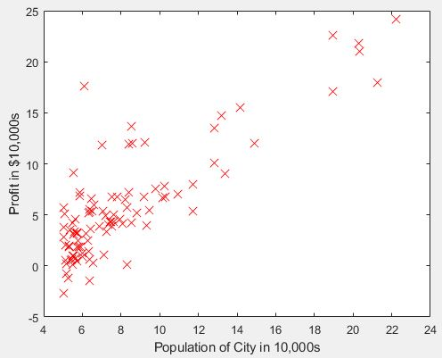

# Programming Assignment #1 - Linear Regression ML

 

Week 2 Assignment.

This assignment covers topics on:
- Linear regression with one variable
- Plotting data
- Cost Function
- Gradient Descent
- Contour plots and suface plots
- Linear regression with multiple variables

### Provided Files
- ex1.m - Octave/MATLAB script that steps you through the exercise
the exercise
- ex1data1.txt - Dataset for linear regression with one variable
- submit.m - Submission script that sends your solutions to our servers
- warmUpExercise.m - Simple example function in Octave/MATLAB
- plotData.m - Function to display the dataset
- computeCost.m - Function to compute the cost of linear regression
- gradientDescent.m - Function to run gradient descent

## 1. Basic Function
Practicing basic syntax like:
```
exp(A);     % exponential e
abs(A);     % absolute value
eye(n);     % nxn identity matrix
sum(A);     % adds all values of the matrix together
floor(A);    % rounds all values down
ceil(A);     % rounds all values up
pinv(A);     % pseudo-inverse of a matrix
ones(r,c);   % rxc matrix of ones
zeros(r,c);   % rxc matrix of zeros
magic(n);     % nxn matrix where the colunms, rows and diagonals add up to the same thing    
```

## 2: Plotting
> In this part of this exercise, you will implement linear regression with one
variable to predict profits for a food truck. Suppose you are the CEO of a restaurant franchise and are considering different cities for opening a new outlet. The chain already has trucks in various cities and you have data for profits and populations from the cities. You would like to use this data to help you select which city to expand
to next.


The dataset is gotten from the `ex1data1.txt` file.

To visualize, these are the first 6 data points:
```
6.1101,17.592
5.5277,9.1302
8.5186,13.662
7.0032,11.854
5.8598,6.8233
8.3829,11.886
```
This is the graph I got from the dataset.



## 3: Cost and Gradient descent
Linear regression minimizes the cost function:


In batch gradient descent, each iteration updates using this equation:


The data is already setup for linear regression and I tested the cost function J(θ) by completing the code in the `computeCost.m` file.

I ran  Gradient Descent by implementing the `gradientDescent.m` file which calls `computeCost` on every iteration. The final parameters are used to plot the linear fit (the blue line).


Using the fit, I was able to predict profit values for population sizes of 35,000 and 70,000.

## 4: Visualizing J(θ0, θ1)
Using the `ex1.m` file -- the information needed to create the plots were given.

I plotted the cost over a 2D grid of θ0 and θ1 values and used the `computeCost` function to calculate J(θ) over a grid of values used to produce a surface and contour plot.

#### Surface Plot

#### Contour Plot


> The purpose of these graphs is to show you that how J(θ) varies with
changes in θ0 and θ1. The cost function J(θ) is bowl-shaped and has a global
mininum. (This is easier to see in the contour plot than in the 3D surface
plot). This minimum is the optimal point for θ0 and θ1, and each step of
gradient descent moves closer to this point.

## My Submission Confirmation
I ran the `submit` function to connect to the `submit.m` file.
```
== Submitting solutions | Linear Regression with Multiple Variables...
Login (email address): *my_email_address*
Token: *my_token_number*
== 
==                                   Part Name |     Score | Feedback
==                                   --------- |     ----- | --------
==                            Warm-up Exercise |  10 /  10 | Nice work!
==           Computing Cost (for One Variable) |  40 /  40 | Nice work!
==         Gradient Descent (for One Variable) |  50 /  50 | Nice work!
==                       Feature Normalization |   0 /   0 | 
==     Computing Cost (for Multiple Variables) |   0 /   0 | 
==   Gradient Descent (for Multiple Variables) |   0 /   0 | 
==                            Normal Equations |   0 /   0 | 
==                                   --------------------------------
==                                             | 100 / 100 | 
```

_________________________

## Linear Regression with Multiple Variables (optional)
I decided to complete this section for extra practice, and also so that I know how to work with multiple variables.

> In this part, you will implement linear regression with multiple variables to predict the prices of houses. Suppose you are selling your house and you want to know what a good market price would be. One way to do this is to first collect information on recent houses sold and make a model of housing prices.

The data is gotten from the `ex1data2.txt` file.
### 1. Feature Normalization
Relevant scripts:
- `ex1_multi.m`
- `featureNormalize.m`

**Feature normalization** is a form of feature scaling when the features differ by various orders of magnitudes.

Task:
- Subtract the mean value of each feature from the dataset: use the `mean` function.
- After subtracting the mean, additionally scale (divide) the feature values
by their respective "standard deviations": use the `std` function.


### 2. Gradient Descent
Relevant scripts:
- `computeCostMulti.m`
- `gradientDescentMulti.m`

The graph I got:


Using a gradient descent algorithm, I was able to predict the price of a 1650 sqft, 3 bedroom house.
### 3. Normal Equations
Relevant scripts:
- `ex1_multi.m`
- `normalEqn.m`

The closed-form solution to linear resgression is:  

Characteristics:
- no feature scaling
- exact solution in one calculation
- no "loop until convergence" (compared to gradient descent)

Using a normal equation algorithm, I was able to predict the price of a 1650 sqft, 3 bedroom house.

----------------------------
## References
NOTE: I will not be posting any solutions that could be of aid to another student because that would violate the [Coursera Honor Code](https://learner.coursera.help/hc/en-us/articles/209818863-Coursera-Honor-Code).

> You may not share your solutions to homework, quizzes, or exams with anyone else unless explicitly permitted by the instructor. This includes anything written by you, as well as any official solutions provided by the course staff.

> You may not engage in any other activities that will dishonestly improve your results or dishonestly improve or damage the results of others.

Also, since this work is directly related to the [Machine Learning Coursera course](https://www.coursera.org/learn/machine-learning/home/welcome), most of the information I reflect upon is gotten directly from it.