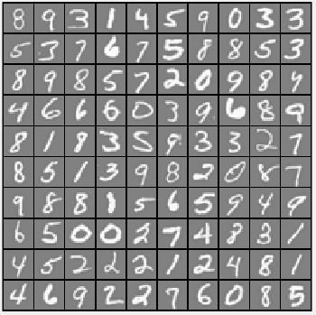
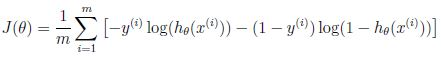
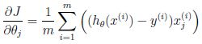
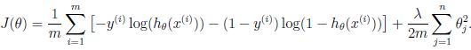
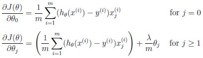
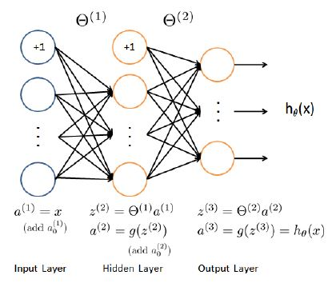
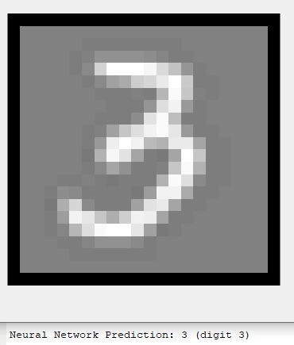
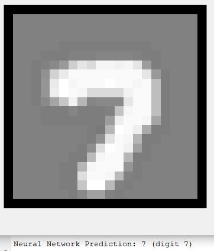

# Programming Assignment #3- Multi-class Classification and Neural Networks

Week 4 Assignment.

This assignment covers topics on:
- Multi-class classification
- Logistic Regression cost function and gradient (unregularized vs regularized)
- Neural networks

## Part 1: Multi-class Classification: one-vs-all
**Goal**: Use logistic regression and neural networks to recognize handwritten digits (0-9).

## 1. Visualizing Data


## 2a. Vectorize Logistic Regression
> Here, I'm making sure that my regularized logistic regression implementation is vectorized. After that, I'll implement one-vs-all classification for the handwritten digit dataset.

For this section, it is important to know the difference between vectorized regularized and unregularized cost function & gradient.

#### Vectorized Unregularized Cost Function

#### Vectorized Unregularized Gradient

#### Vectorized Regularized Cost Function

#### Vectorized Regularized Gradient


## 2b. One-vs-All Training
> Implement one-vs-all classification by
training multiple regularized logistic regression classifiers, one for each of
the K classes in our datase -- (K=10 for the handwritten digits dataset)


| Function | Description |
| --- | --- |
| `fminunc` | finds a local minimum of a function of several variables |
| `fmincg` | minimizes a continuous differentialble multivariate function. Usage: [X, fX, i] = fmincg(f, X, options, P1, P2, P3, P4, P5)|

`fmincg` is used in this assignment to optimize the cost function for each class

## 3. Predict for One-Vs-All
In this section, I would be predicting the digit in each image by computing the probability of it being in a particular class (using the trained log reg classifiers).


## Part 2: Neural Networks
> In the previous part of this exercise, you implemented multi-class logistic regression to recognize handwritten digits. However, logistic regression cannot form more complex hypotheses as it is only a linear classifier. The neural network will be able to represent complex models that form non-linear hypotheses.

The neural net model:



**Feedforward propagation**: computes h<sub>θ</sub>(x<sup>(i)</sup>) for every example i and returns the associated predictions.

Output example that I got:





## My Submission Confirmation
I ran the `submit` function to connect to the `submit.m` file.
```
== Submitting solutions | Multi-class Classification and Neural Networks...
Use token from last successful submission (*my_email_address*)? (Y/n): Y
==                                   Part Name |     Score | Feedback
==                                   --------- |     ----- | --------
==             Regularized Logistic Regression |  30 /  30 | Nice work!
==              One-vs-All Classifier Training |  20 /  20 | Nice work!
==            One-vs-All Classifier Prediction |  20 /  20 | Nice work!
==          Neural Network Prediction Function |  30 /  30 | Nice work!
==                                   --------------------------------
==                                             | 100 / 100 | 
== 

```

----------------------------
## References
NOTE: On this page, I only included the end-result (plots) and the equations I used in each section. This git documentation is solely for reflection of the overall process and concepts, not solutions. 

I did not post any solutions that could be of aid to another student because that would violate the [Coursera Honor Code](https://learner.coursera.help/hc/en-us/articles/209818863-Coursera-Honor-Code). 

> You may not share your solutions to homework, quizzes, or exams with anyone else unless explicitly permitted by the instructor. This includes anything written by you, as well as any official solutions provided by the course staff.

> You may not engage in any other activities that will dishonestly improve your results or dishonestly improve or damage the results of others.

Also, since this work is directly related to the [Machine Learning Coursera course](https://www.coursera.org/learn/machine-learning/home/welcome), most of the information I reflect upon is gotten directly from it.